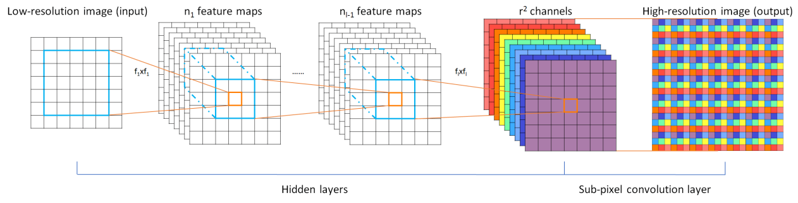
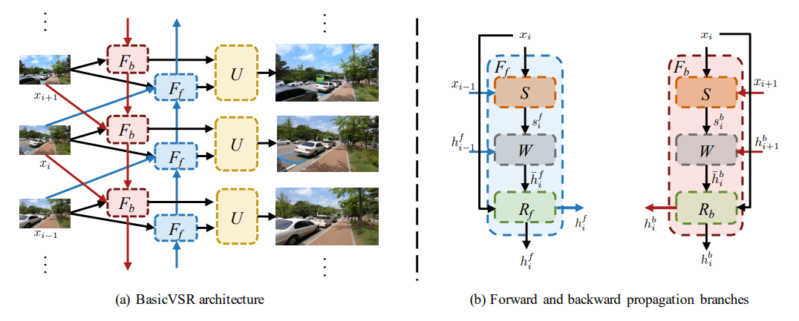

# Real-Time Video Super-Resolution Application on VCK5000

## Overview

This repository is used to submit the Adaptive Computing Challenge 2021 with Xilinx.

## Table of contents

- [Real-Time Video Super-Resolution Application on VCK5000](#Real-Time Video Super-Resolution Application on VCK5000)
    - [Overview](#overview)
    - [Table of contents](#table-of-contents)
    - [Introduction](#Introduction)
    - [Model](#Model)
        - [ESPCN](#ESPCN)
            - [About Real-Time Single Image and Video Super-Resolution Using an Efficient Sub-Pixel Convolutional Neural Network](#About Real-Time Single Image and Video Super-Resolution Using an Efficient Sub-Pixel Convolutional Neural Network)
        - [BasicVSR](#BasicVSR)
            - [About The Search for Essential Components in Video Super-Resolution and Beyond](#About The Search for Essential Components in Video Super-Resolution and Beyond)
    - [Completed Work](#Completed Work)
    - [To-do List](#To-do List)
    - [Conclusion](#Conclusion)
    - [Reference](#Reference)

## Introduction

In recent years, the resolution of high-definition displays has reached a new level, such as 1920x1080 for HDTV and 3840x2160 for some ultra-high-definition 4k TVs. However, with advanced display devices, relatively early movies, TV programs or games are often not well represented in the aforementioned devices, which greatly reduces the user's sense of experience. In the past, most of the high-definition remakes of classic games and movies were mainly based on multimedia materials, and this part of the work could only be completed by professional designers, which took a lot of time and resources.

At the same time, in order to meet the real-time audio and video transmission on the mobile terminal, low resolution is also a pain point, which is due to the limitation of transmission bandwidth and real-time requirements. Low-resolution video cannot effectively display image details, thus bringing limited user experience. Therefore, it is of great significance to perform video real-time super-score.

In this challenge, I intends to use the powerful AIE inference computing power of **[VCK5000](https://www.xilinx.com/products/boards-and-kits/vck5000.html)** to reproduce the papers based on neural network super-resolution in recent years. The most typical models are the **[ESPCN](#ESPCN)** and **[BasicVSR](#BasicVSR)** models, which have simple structures and can effectively use AIE to accelerate operations based on convolutional neural networks.

## Model

### ESPCN

#### About Real-Time Single Image and Video Super-Resolution Using an Efficient Sub-Pixel Convolutional Neural Network

Here's an abstract straight from the paper:

Recently, several models based on deep neural networks have achieved great success in terms of both reconstruction accuracy and computational performance for single image super-resolution. In these methods, the low resolution (LR) input image is upscaled to the high resolution (HR) space using a single filter, commonly bicubic interpolation, before reconstruction. This means that the super-resolution (SR) operation is performed in HR space. We demonstrate that this is sub-optimal and adds computational complexity. 

In this paper, we present the first convolutional neural network (CNN) capable of real-time SR of 1080p videos on a single K2 GPU. To achieve this, we propose a novel CNN architecture where the feature maps are extracted in the LR space. In addition, we introduce an efficient sub-pixel convolution layer which learns an array of upscaling filters to upscale the final LR feature maps into the HR output. By doing so, we effectively replace the handcrafted bicubic filter in the SR pipeline with more complex upscaling filters specifically trained for each feature map, whilst also reducing the computational complexity of the overall SR operation. We evaluate the proposed approach using images and videos from publicly available datasets and show that it performs significantly better (+0.15dB on Images and +0.39dB on Videos) and is an order of magnitude faster than previous CNN-based
methods.

### BasicVSR

#### About The Search for Essential Components in Video Super-Resolution and Beyond

Here's an abstract straight from the paper:

Video super-resolution (VSR) approaches tend to have more components than the image counterparts as they need to exploit the additional temporal dimension. Complex designs are not uncommon. In this study, we wish to untangle the knots and reconsider some most essential components for VSR guided by four basic functionalities, i.e., Propagation, Alignment, Aggregation, and Upsampling. By reusing some existing components added with minimal redesigns, we show a succinct pipeline, BasicVSR, that achieves appealing improvements in terms of speed and restoration quality in comparison to many state-of-the-art algorithms. We conduct systematic analysis to explain how such gain can be obtained and discuss the pitfalls. We further show the extensibility of BasicVSR by presenting an informationrefill mechanism and a coupled propagation scheme to facilitate information aggregation. The BasicVSR and its extension, IconVSR, can serve as strong baselines for future VSR approaches.


## Completed Work

First, we successfully installed the environment required for [VCK5000](https://www.xilinx.com/products/boards-and-kits/vck5000.html) to run on Ubuntu20.04.1, including XRT and [Vitis-AI](https://github.com/Xilinx/Vitis-AI). And we successfully run the ResNet50 demo on VCK5000.

Since we used the Xilinx hardware development process to design, we spent a lot of time in the early stage to learn the vitis-ai software method implementation and the use of new devices

Then, we simply reproduced the ESPCN model and retraining using pytorch 1.7.0 in Docker, and quantified the model using the Quantization Tool in Vitis-AI. 

Sadly, due to the Covid-19 pandemic and other work arrangements, we only have one month to complete the above:(

## To-do List

If we can have more time to complete this project in addition to the competition, then the next work is our goal.

- [ ] Implement and debug the real-time super-resolution application
- [ ] Deploy the generated .xmodel to VCK5000
- [ ] Replace the ESPCN model with the BasicVSR model for better visual effects

## Reference

### [Real-Time Single Image and Video Super-Resolution Using an Efficient Sub-Pixel Convolutional Neural Network](https://arxiv.org/abs/1609.05158v2)

*Wenzhe Shi, Jose Caballero, Ferenc Huszár, Johannes Totz, Andrew P. Aitken, Rob Bishop, Daniel Rueckert, Zehan Wan*g <br>

[[Paper]](https://arxiv.org/pdf/1609.05158)

```
@article{DBLP:journals/corr/ShiCHTABRW16,
  author    = {Wenzhe Shi and
               Jose Caballero and
               Ferenc Husz{\'{a}}r and
               Johannes Totz and
               Andrew P. Aitken and
               Rob Bishop and
               Daniel Rueckert and
               Zehan Wang},
  title     = {Real-Time Single Image and Video Super-Resolution Using an Efficient
               Sub-Pixel Convolutional Neural Network},
  journal   = {CoRR},
  volume    = {abs/1609.05158},
  year      = {2016},
  url       = {http://arxiv.org/abs/1609.05158},
  archivePrefix = {arXiv},
  eprint    = {1609.05158},
  timestamp = {Mon, 13 Aug 2018 16:47:09 +0200},
  biburl    = {https://dblp.org/rec/journals/corr/ShiCHTABRW16.bib},
  bibsource = {dblp computer science bibliography, https://dblp.org}
}
```

### [BasicVSR: The Search for Essential Components in Video Super-Resolution and Beyond](https://arxiv.org/pdf/2012.02181)

*[Kelvin C.K. Chan](https://ckkelvinchan.github.io/), [Xintao Wang](https://xinntao.github.io/), [Ke Yu](https://yuke93.github.io/), [Chao Dong](https://scholar.google.com.hk/citations?user=OSDCB0UAAAAJ&hl=zh-CN), [Chen Change Loy](http://personal.ie.cuhk.edu.hk/~ccloy/)* 

[[Paper]](https://arxiv.org/pdf/2012.02181)

```
@InProceedings{chan2021basicvsr,
  author = {Chan, Kelvin CK and Wang, Xintao and Yu, Ke and Dong, Chao and Loy, Chen Change},
  title = {BasicVSR: The Search for Essential Components in Video Super-Resolution and Beyond},
  booktitle = {Proceedings of the IEEE conference on computer vision and pattern recognition},
  year = {2021}
}
```

